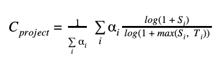

# Open Source Project Criticality Score

This project is maintained by members of the
[Securing Critical Projects WG](https://github.com/ossf/wg-securing-critical-projects).

## Goals
1. Generate a **criticality score** for every open source project.

1. Create a list of critical projects that the open source community depends on.

1. Use this data to proactively improve the security posture of these critical projects.

## Usage

The program only requires one argument to run, the name of the repo:

```shell
$ pip3 install .

$ criticality_score --repo github.com/kubernetes/kubernetes
name: kubernetes
url: https://github.com/kubernetes/kubernetes
language: Go
created_since: 78
updated_since: 0
contributor_count: 3649
org_count: 5
commit_frequency: 105.9
recent_releases_count: 77
closed_issues_count: 3333
updated_issues_count: 5489
comment_frequency: 5.4
dependents_count: 403529
criticality_score: 0.98514
```

A project's criticality score is a number between 0 and 1. It is based on
the following algorithm:



It is derived using the following parameters:

| Parameter (S<sub>i</sub>)  | Weight (&alpha;<sub>i</sub>) | Max threshold (T<sub>i</sub>) | Description |
|---|---:|---:|---|
| created_since | 1 | 120 | Time since the project was created (in months) |
| updated_since  | -1 | 120 | Time since the project was last updated (in months) |
| contributor_count | 2 | 5000 | Count of project contributors (with commits) |
| org_count | 1 | 10 | Count of distinct organizations that contributors belong to |
| commit_frequency | 1 | 1000 | Average number of commits per week in the last year |
| recent_releases_count | 0.5 | 26 | Number of releases in the last year |
| closed_issues_count | 0.5 | 5000 | Number of issues closed in the last 90 days |
| updated_issues_count | 0.5 | 5000 | Number of issues updated in the last 90 days |
| comment_frequency | 1 | 15 | Average number of comments per issue in the last 90 days |
| dependents_count | 2 | 500000 | Number of project mentions in the commit messages |

### Authentication

Before running criticality score, you need to
[create a GitHub access token](https://docs.github.com/en/free-pro-team@latest/developers/apps/about-apps#personal-access-tokens)
and set it in environment variable `GITHUB_AUTH_TOKEN`.
This helps to avoid the GitHub's
[api rate limits](https://developer.github.com/v3/#rate-limiting)
with unauthenticated requests.

```shell
# For posix platforms, e.g. linux, mac:
export GITHUB_AUTH_TOKEN=<your access token>

# For windows:
set GITHUB_AUTH_TOKEN=<your access token>
```
### Formatting Results

There are three formats currently: `default`, `json`, and `csv`. Others may be added in the future.

These may be specified with the `--format` flag.

## Contributing

If you want to get involved or have ideas you'd like to chat about, we discuss this project in the [Securing Critical Projects WG](https://github.com/ossf/wg-securing-critical-projects) meetings.

See the [Community Calendar](https://calendar.google.com/calendar?cid=czYzdm9lZmhwNWk5cGZsdGI1cTY3bmdwZXNAZ3JvdXAuY2FsZW5kYXIuZ29vZ2xlLmNvbQ) for the schedule and meeting invitations.

See the [Contributing](CONTRIBUTING.md) documentation for guidance on how to contribute.
