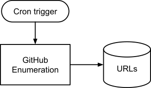

# Criticality Score Revamp: Milestone 2

## Productionizing Criticality Score

- Author: [Caleb Brown](mailto:calebbrown@google.com)
- Updated: 2022-08-26
- Status: Draft

# Goals

The primary goal of Milestone 2 is to ensure the fresh criticality score data is
always available and enable continuous improvement on how the scores are
calculated.

To achieve this the criticality score system will be productionized to
continuously update the criticality score for GitHub repositories with at least
20 stars.

## Non-Goals

The same non-goals for
[Milestone 1](https://github.com/ossf/criticality_score/blob/main/docs/design/milestone_1.md)
apply to this milestone:

* Improving the score
* Covering source repositories on non-GitHub hosts
* De-duping mirrors

While these are important, they are beyond the scope of this milestone.

# Background

This work is a follow up to
[Milestone 1](https://github.com/ossf/criticality_score/blob/main/docs/design/milestone_1.md).

The Criticality Score project is used by the OpenSSF and the Securing Critical
Projects Work Group (WG) for determining which Open Source projects are
"critical". Critical Open Source projects are those which are broadly depended
on by organizations, and present a security risk to those organizations, and
their customers, if they are not supported.

Improving the criticality score requires introducing new data sources and
signals and collecting them across all repositories.

Additionally the open source ecosystem is dynamic, and an unassuming project can
quickly become critical if it becomes a dependency of one or two popular
projects.

## Key Challenges

There are two key challenges with collecting and scoring critical projects:

1. Duration
2. API token management

Duration makes it impractical for an individual to run the signal data
themselves across a large number of open source projects. An interruption or
failure across multiple days or weeks needed to complete the signal collection
requires constant monitoring.

Efficiently collecting signals requires access to many GitHub API tokens and
monitoring of quotas to avoid unnecessary delays when quotas are met. Multiple
tokens also allows greater parallelism and faster collection.

Building centralized infrastructure for automating the collection of signals
across all open source projects helps address these challenges.

## Scorecard Infrastructure

The Scorecard project has already built out automation for collecting and
aggregating data across hundreds of thousands of repositories, as documented in
[Scalable Scorecard](https://github.com/ossf/scorecard/blob/main/docs/design/scalable_scorecards.md).

Productionizing the collection of signals for calculating a criticality score
aligns well with this infrastructure.

# Design

## Enumeration

### Initiation

A Kubernetes schedule starts the enumeration process.

Initially the enumeration will be scheduled to be run weekly.

### Output

#### Project URLs

After completion, the enumerated project URLs will be stored in one or more text
files in a bucket with a prefix containing a unique `runID`.

`runID` will be the start date and time (UTC) in `YYYYMMDD-HHmm` format. E.g.
`20220810-1302` or `20220810-2359`.

The filename(s) for the urls will be unique to the enumerator used. They must be
a key that identifies the enumerator, and have an extension of `.txt`.

For GitHub enumeration the key will be `github`, so the filename will be
`github.txt`.

Full example: `bucket/20220810-1302/github.txt`

#### Marker file

After all text files are written to the `runID` based prefix, a marker file will
be written with the prefix for the last completed run. Subsequent runs will
overwrite the same marker file.

While it is possible to identify the most recent `runID` by iterating through
entries in a bucket, a marker file avoids the issues of iterating through items
in a bucket (e.g. race conditions).

### Implementation

The GitHub enumeration tool will be altered in the following way:

* Support environment variables along with flags for easy configuration through
  kubeconfig YAML files.
* The ability to specify a destination bucket and file for project URLs. `runID`
  can be specified using a token (e.g. `[[run-id]]`).
* The ability to specify a destination bucket and file for the marker file.

Cloud infrastructure changes:

* A service worker needs to be associated with the enumeration.
* A bucket with write access by the above service worker.
    * A lifecycle policy on the bucket to clean up stale data.
* A Kubernetes configuration with the following:
    * The desired schedule
    * The destination bucket and path structure
    * The address + port of the Scorecard GitHub token auth server

### Out of Scope

#### Additional Reliability and Performance

GitHub enumeration is reasonably reliable already, however it is still
susceptible to failures (e.g. network, cloud storage).

Given that the GitHub enumeration only takes 4-6 hours to complete for all
projects with at least 10 stars, additional efforts to improve reliability will
be deferred.

In the future an architecture similar to the Signal Collection and Scorecard
project can be used to improve performance and reliability.

#### Deduplication

Deduplication of URLs from different sources is out of scope. Long term this
will be important to ensure API quotas are used efficiently. For Milestone 2,
deduplication will be done when results are being reduced as this needs to be
handled anyway (e.g. a timeout triggers a second set of signals to be collected
for the same repository).

## Signal Collection

To scale signal collection we will build upon the Scorecard project's
infrastructure.

The
[Scalable Scorecard](https://github.com/ossf/scorecard/blob/main/docs/design/scalable_scorecards.md)
covers the specifics of the Scorecard infrastructure.

To use the Scorecard infrastructure we will need to make the following changes
to the Scorecard project:

* Controller URL iteration ([ref](https://github.com/ossf/scorecard/blob/main/cron/internal/data/iterator.go))
    * Read from `bucket/{runID}/*.txt` instead of the static CSV file.
    * Note: may require changes to the shuffling.
* Worker library ([ref](https://github.com/ossf/scorecard/blob/main/cron/internal/worker/main.go))
    * Create a reusable library for:
        * consuming PubSub messages containing work shards
        * writing the shards to storage
* Data-transfer library ([ref](https://github.com/ossf/scorecard/blob/main/cron/internal/bq/main.go))
    * A reusable library for determining if all shards are present, and: iterating over the resulting CSV files (e.g. BigQuery loader) and/or iterating over each record in the resulting CSV files.

Additionally, the following changes need to be made to the Criticality Score project:

* Implement a criticality score specific worker
    * Refactor and clone the `collect_signals` tool into a new
      `criticality_score` command, which continues as a CLI focused tool for
      end-users.
    * Adapt the `collect_signals` command to:
      * use the "worker library" above to consume shards of work from a PubSub
        channel.
      * write each shard as a CSV file to a bucket location.
      * consume configuration information from the scorecard config.yaml file,
        and environment variables.
* Implement a criticality score specific data-transfer service to combine CSV
  data together, add a default score and upload data to BigQuery.

Cloud Infrastructure Changes:

* TBC

### Out of Scope

TBC

## Monitoring

* GitHub Enumeration
    * Token Usage: use existing scorecard OpenCensus monitoring.
    * Health:
        * Time since last URL file was written/created.
        * OpenCensus metric on # urls written
* Signal Collection
    * Token Usage: clone scorecard dashboard and update OpenCensus prefix.
    * Health:
        * Clone scorecard dashboard and update OpenCensus prefix.
        * Total number of signals collected, or signals collected per second.

## Release Process

How to deploy updates to production.

TBC

# Rollout Plan

TBC

Primary concern: GitHub token health.
